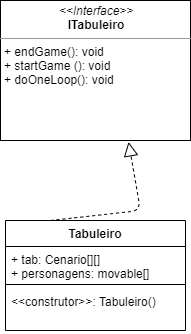
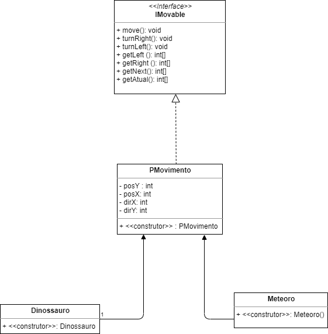
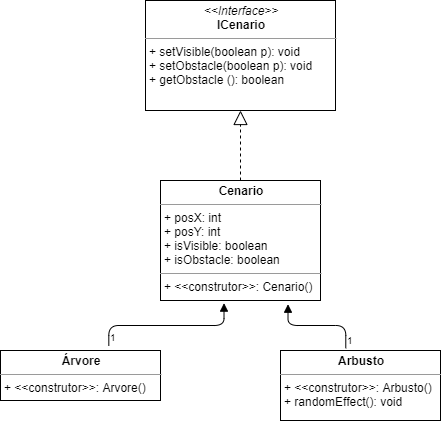
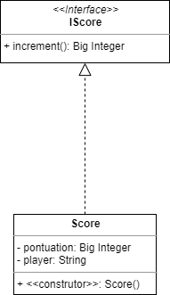

# Projeto `DinosaurMaze`

## Equipe
* David Afonso Borges dos Santos- 261032
* Mariana Sartorato Jorge - 241334

## Descrição Resumida do Projeto
Os dinossauros estão correndo risco de extinção. Nesse jogo, o jogador irá ajudar um dinossauro a fugir de meteoros que estão o perseguindo. O jogo será formado por um tabuleiro e peças que se movimentam nele. As peças que serão encontradas ao longo do tabuleiro são: árvores (serão obstáculos no caminho do dinossauro, que terá que contorná-las), meteoros (estarão tentando ir atrás do dinossauro), o dinossauro (vai tentar fugir dos meteoros e ganhar pontos), arbustos escondendo utensílios (esses utensílios poderão ajudar ou atrapalhar o dinossauro na sua fuga) e comida (cada peça comida aumentará em 500 pontos a pontuação do jogador). Os objetivos do jogo são: fugir dos meteoros e ganhar o maior número de pontos possível. O jogo acaba quando a comida disponível acaba ou quando o dinossauro é atingido por algum meteoro.

## Vídeo do Projeto
[Link do vídeo](https://www.youtube.com/watch?v=qXy4wn0Sr80)

## Diagrama geral das Componentes

## Componentes

## Tabuleiro

### Interfaces

Interfaces associadas a esse componente:

Campo | Valor
----- | -----
Classe | Tabuleiro
Autores | David e Mariana
Objetivo | Representar o espaço do jogo
Interface | ITabuleiro
~~~
public interface ITabuleiro {
  void endGame();
  void startGame();
  void doOneLoop();
}
~~~

## Detalhamento das Interfaces

### Interface `ITabuleiro`
Iniciar e relizar movimentos do jogo no tabuleiro até que ele acabe.

Método | Objetivo
-------| --------
startGame() | iniciar o jogo posicionando as peças
endGame()| ver se o dinossauro ainda está vivo, se não estiver, acabar com o jogo
doOneLoop() | 

## PeçasMovimento

### Interfaces

Interfaces associadas a esse componente:

Campo | Valor
----- | -----
Classe | PMovimento
Autores | David e Mariana
Objetivo | Mover o dinossauro e o meteoro pelo tabuleiro
Interface | IMovable
~~~
public interface IMovable {
  void move();
  void turnRight();
  void turnLeft();
  int[] getLeft();
  int[] getRight();
  int[] getAtual();
  int[] getNext();
}
~~~

## Detalhamento das Interfaces

### Interface `IMovable`
Relizar movimentos do dinossauro e dos meteoros no jogo.

Método | Objetivo
-------| --------
move() | movimenta peças
turnRight()| vai para a direita
turnLeft() | vai para a esquerda
getLeft () | vê se a esquerda está livre
getRight() | vê se a direita está livre
getAtual () | mostra a posição atual do dinossauro
getNext () | vê a próxima posição 

## Cenário

### Interfaces 

Interfaces associadas a cenário:

Campo | Valor
----- | -----
Classe | Cenario
Autores | David e Mariana
Objetivo | Colocar objetos no tabuleiro
Interface | ICenario
~~~
public interface ICenario {
  void setVisible(boolean p);
  void setObstacle(boolean p);
  boolean getObstacle();
}
~~~

## Detalhamento das Interfaces

### Interface `ICenario`
Colocar objeto/peças que não realizam movimento no tabuleiro.

Método | Objetivo
-------| --------
setVisible() | muda a visibilidade da casa, a partir do parâmetro p 
setObstacle() | muda a condição de obstáculo ou não da casa a partir do parâmetro p
getObstacle() | vê se a casa é um obstáculo  

## Score

### Interfaces 

Interfaces associadas ao placar:

Campo | Valor
----- | -----
Classe | Placar
Autores | David e Mariana
Objetivo | Registrar a pontuação do jogador
Interface | IScore
~~~
public interface ICenario {
  void inncrement();
}
~~~

## Detalhamento das Interfaces

### Interface `IScore`
Alterar a pontuação do jogador.

Método | Objetivo
-------| --------
increment() | incrementa a pontuação do jogador  

